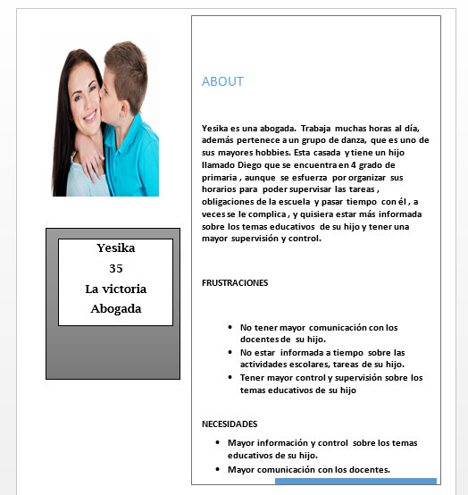

## UNITED SCHOOL

### United School tiene la misión de ayudar a que cada profesor y padre de familia  crea en un aula increible .

### Plan de investigación
##### Objetivos
- Comprender y Conocer las deficiencias , bloqueantes de la comunicación entre padres de familia y maestros.
- Comprender  que información es relevante y más frecuentemente consultado por  los padres de familia a los docentes.

- Conocer y comprender las complicaciones que tienen los maestros  , para mantener informados a los padres de familia.

## DESCUBRIMIENTO E INVESTIGACIÓN

#### MÉTODOS DE INVESTIGACIÓN
##### BENCHMARKING
Se realizó un estudio de Benchmarking ,que me permitio conocer las cualidades que tienen otras aplicaciones similares ;lo que estan haciendo bien  y tambien detectar las falencias , para no cometer los mismo errores y añadirle valores agregados diferenciadores a mi producto.
El resumen del estudio fue el siguiente :

##### ENCUESTAS ONLINE
Se realizó encuestas que fueron enviadas a un público de alrededor 14 personas a través de internet, con la finalidad de darnos una idea de la situación actual, problemática , deficiencias , y  comportamiento , etc.
https://docs.google.com/forms/d/1Rj9vAGBSA86czBd6utzLJhDqw4eraFe2zP0hnnGjbJQ/edit#responses

##### ENTREVISTAS
 Con la finalidad de conocer más a fondo la problemática  , y obtener  información de los maestros,  salí a realizar entrevistas para obtener la mayor información posible .

 

 

 ##### STAKEHOLDERS
 - Equipo de desarrollo de las diferentes áreas.
 - Equipo completo de trabajo (marketing , diseñadores , investigadores (research) programadores , finanzas , etc )
 - Colegios
 - profesores
 - Directores de Colegios
 - Padres de familia
 - Familias
 - Estudiantes
 - MINEDU

 ##### BUSINESS MODEL CANVAS
  

## SINTESIS E IDEACIÓN
En esta etapa me enfoque en obtener los insights de los usuarios a través de la recopilación y análisis de información de nuestra investigación.

#### DIAGRAMA DE AFINIDAD
Se realizó un diagrama de Afinidad con la finalidad de poder analizar los datos obtenidos de las encuestas y entrevistas y agruparlos de acuerdo a las similutes de las respuestas. Los temas encontrados fueron :

 - consultas
 - seguridad
 - supervisión
 - comunicación
 - medios de comunicación
 - Complicaciones
 - temas + consultados

 

 

 Luego de analizar todo la información , se obtuvo que las consultas más realizadas por lo padres de familia a los docentes fueron sobre :

- Actividades , reuniones
- tareas y trabajos
- Progreso académico

#### USER PERSONA
En esta etapa definí al user person .

 

#### DEFINICIÓN DEL PROBLEMA
Esta etapa es muy importante para entender el problema que deseo resolver  luego de  analizar toda la data recabada.Es por eso que utilicé una serie técnicas para abordar mejor los problemas encontrados  y definir  los requerimientos principales .

Realicé algunas  preguntas que me ayudarán  a definir mejor el problema:

•	**¿Qué problema estamos tratando de resolver?**
Lograr que los padres de familia estén más informados de las actividades escolares, tareas, obligaciones, etc de sus hijos y así lograr un fin mayor que es lo padres de familia estén realmente sumergidos y al  tanto de la educación de sus hijos.
Lograr una mayor  comunicación e intercambio de información  entre los padres de familia y los maestros.

• **¿Cómo sabemos que esto es un problema real?**
Se realizó un estudio de  investigación  y research, utilizando diversos métodos como entrevistas, encuestas tanto a profesores como a padres de familia   y se detectó que realmente hay una problemática con toda la información que me brindaron.

•	**¿Por qué es importante resolverlo?**

Porque  queremos mejorar la comunicación entre los padres y docentes, brindándoles facilidades para lograr una  comunicación frecuente y activa y trabajen en conjunto para el  bienestar de  los alumnos.

•	**¿Quiénes son nuestros usuarios? ¿Cuáles son sus objetivos y motivaciones?**
Nuestro público objetivo  son los padres de familia y docentes   en etapa escolar.
- Los docentes desean  una mayor comunicación e intervención de los padres de familia  en los temas educativos de sus hijos.
- Los padres de familia  quieren mayores facilidades y medios para obtener información sobre las actividades y agenda escolar  de sus hijos de manera rápida y fácil.

 ##### PROBLEM STATEMENTS

 **[Yesika]** quisiera  estar más informada sobre las actividades escolares, reuniones  de padres, etc.

**[Yesika]** quisiera tener más comunicación con el docente de su hijo.

**[Yesika]** quisiera recordatorios de   las actividades escolares de sus hijos y así que evitar que nada se le olvide.

**[Yesika]** Quisiera información detallada en cuanto a los cursos, agenda escolar mensual.

 ##### HMW

 ¿**Cómo podría** brindar más facilidades  para lograr una mayor interacción y comunicación entre los padres de familia y maestros?

¿**Cómo podría** brindarles mayor información a los padres de familia sobre las actividades escolares de sus hijos?

¿**Cómo podría** lograr que los maestros compartan información relevante a los padres de familia de manera rápida y fácil, logrando una mayor inmersión de los padres en los temas educativos de sus hijos?

##### WHAT IF
¿**what if** los padres de familia y maestros puedan tener mayor comunicación?

¿**what if** existiera una aplicación con la agenda escolar, recordatorios de actividades, información relevante   de los alumnos?

¿**what if** los maestros pudieran tener más medios para mantener más  informados  a los padres de familia con respecto a actividades escolares   , progreso , tareas de los alumnos?

### CONCEPTUALIZACIÓN

Despúes  de haber realizado el planteamiento  y análisis de toda la información pude reconocer  cúales son los principales requerimientos .

### FEATURE LIST
### MVP
Mi producto mínimo viable contendrá lo siguiente:
- Información sobre la agenda  mensual  de las actividades escolares

- Recordatorios de las actividades  escolares

- Horario de los cursos

- Observaciones del docente

- Asistencia

- Receptor de lectura instantánea

- Gráficos del  progreso general  del aula

-	Gráficos del progreso individual semanal

Este mínimo producto viable se realizó debido a que representa lo esencial y es de bajo costo realizarlo.

## PROTOTIPADO EN PAPEL

## PROTOTIPADO  EN MARVEL

https://marvelapp.com/64127c1/screen/40086842

0
